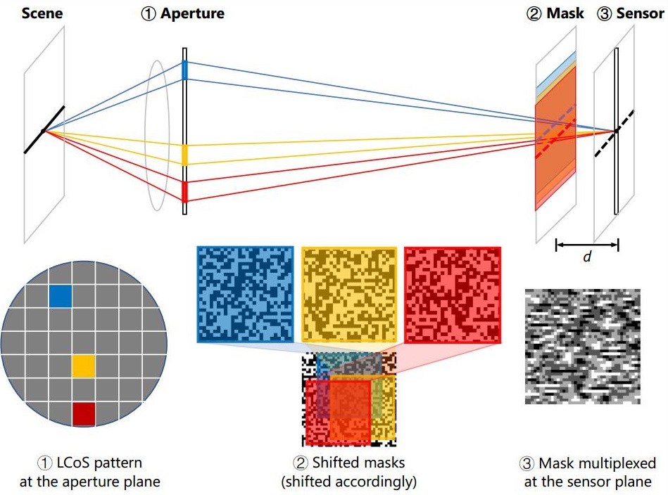
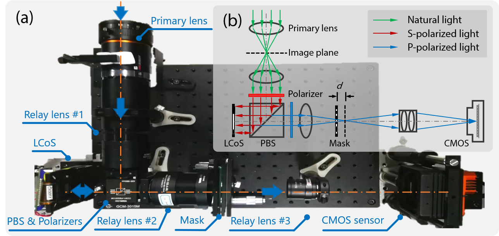

# 10 Mega Pixel Snapshot Compressive Imaging with A Hybrid Coded Aperture (HCA-SCI) 
This repository contains the Python (PyTorch) code for our paper **10 Mega Pixel Snapshot Compressive Imaging with A Hybrid Coded Aperture** by [Zhihong Zhang*](https://zhihongz.github.io/),  [Chao Deng*](https://www.researchgate.net/profile/Chao-Deng-9), [Yang Liu](https://liuyang12.github.io/), [Xin Yuan](https://www.bell-labs.com/usr/x.yuan), [Jinli Suo](https://sites.google.com/site/suojinli/), and [Qionghai Dai](http://media.au.tsinghua.edu.cn/). [[doi\]](https://doi.org/10.1364/PRJ.435256) [[github\]](https://github.com/zhihongz/HCA-SCI) [[arXiv\]](https://arxiv.org/abs/2106.15765)

The initial Python code for [PnP-SCI](https://github.com/liuyang12/PnP-SCI) was from [Yang Liu](https://liuyang12.github.io "Yang Liu, MIT") and [Dr. Xin Yuan](https://sites.google.com/site/eiexyuan/ "Dr. Xin Yuan, Bell Labs").


## HCA-SCI

In this paper, we build a novel hybrid coded aperture snapshot compressive imaging (HCA-SCI) system by incorporating a dynamic liquid crystal on silicon and a high-resolution lithography mask. We further implement a PnP reconstruction algorithm with cascaded denoisers for high quality reconstruction. Based on the proposed HCASCI system and algorithm, we achieve a 10-mega pixel SCI system to capture high-speed scenes, leading to a high throughput of 4.6G voxels per second. Both simulation and real data experiments verify the feasibility and performance of our proposed HCA-SCI scheme.


## Schematic diagram

The aperture of the system (i.e. the activate area of the LCoS) can be divided into several sub-apertures according to the resolution of the LCoS after pixel binning, and each sub-aperture corresponds to a light beam propagating towards certain directions. As shown in the figure below, because the lithography mask is placed in front of the image plane, when different sub-apertures are turned on, the light beams from the corresponding sub-apertures will project the mask onto different parts of the image plane, which can thus generate corresponding shifting encoding masks. In practice, to enhance the light throughput, multiple sub-apertures will be turned on simultaneously in one frame by assigning the LCoS with a specific multiplexing pattern to obtain a single multiplexing encoding mask. And in different frames, different combinations of the sub-apertures are applied to generate different multiplexing encoding masks. Generally, we turn on 50% of the sub-apertures in one multiplexing pattern. In this multiplexing case, the final encoding mask on the image plane will be the summation of those shifting masks provided by the corresponding sub-apertures.




## System implementation

The hardware setup of our HCA-SCI system is depicted in the figure below. The incident light from a scene is first collected by the primary lens and focused at the first virtual image plane. Then a 4f system consisting of two achromatic doublets transfers the image through the aperture coding module and the lithography mask, and subsequently onto the second virtual image plane. The aperture coding module positioned at the middle of the 4f system is composed of a polarizing beamsplitter, two film polarizers and an amplitude-modulated LCoS, which are used to change the open-close states ('open' means letting the light go through while 'close' means blocking the light) of the sub-apertures and thus modulate the light's propagation direction. Finally, the image delivered by the 4f system is relayed to the camera sensor being captured. Note that the 4f system used in our system has a magnification of 1, and the relay lens has a magnification of 2, which on the whole provides a 1:2 mapping between pixels of the lithography mask and the sensor. During the acquisition process, the camera shutter is synchronized with the LCoS by using an output trigger signal from the LCoS driver board.




## Usage

This code is tested on Windows 10 CUDA 10.0.130, CuDNN 7.6.0, and PyTorch 1.2.0. It is supposed to work on other platforms (Linux or Windows) with CUDA-enabled GPU(s). 

1. Download the dataset from [BaiduDisk](https://pan.baidu.com/s/1ZLzKTmKtF0a3dY8wYV3dgQ) (code `0000`) and put it into `./dataset`.
2. Create the virtual environment with required Python packages via  
`conda env create -f environment.yml`
2. Run  `pnp_sci_video_data_simuexp_test.py` to test the simulated data.
3. Run  `pnp_sci_video_data_realexp_test.py` to test the real data.


## More information

- Please refer to [PnP-SCI](https://github.com/liuyang12/PnP-SCI) for detailed information about PnP-SCI algorithm.
- The code for BIRNAT can be found in https://github.com/BoChenGroup/BIRNAT


## Citation

```
@article{zhang202110Mega,
  title = {10 Mega Pixel Snapshot Compressive Imaging with A Hybrid Coded Aperture},
  author = {Zhang, Zhihong and Deng, Chao and Liu, Yang and Yuan, Xin and Suo, Jinli and Dai, Qionghai},
  year = {2021},
  journal = {Photonics Research},
  doi = {10.1364/PRJ.435256},
}
```

